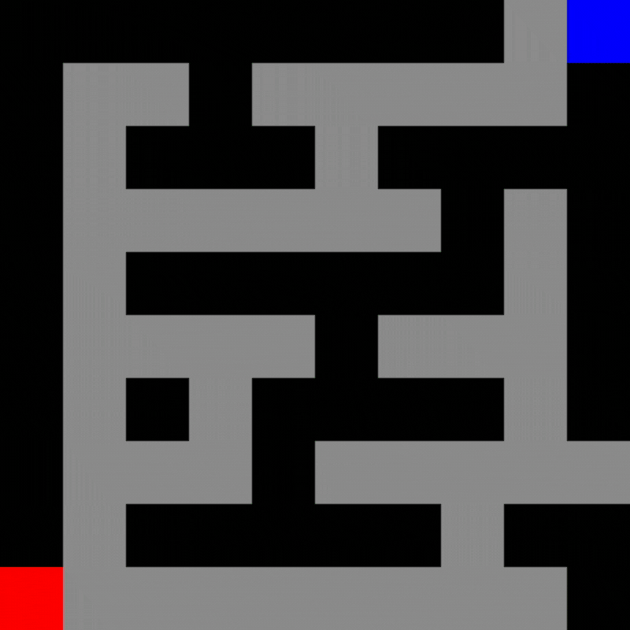
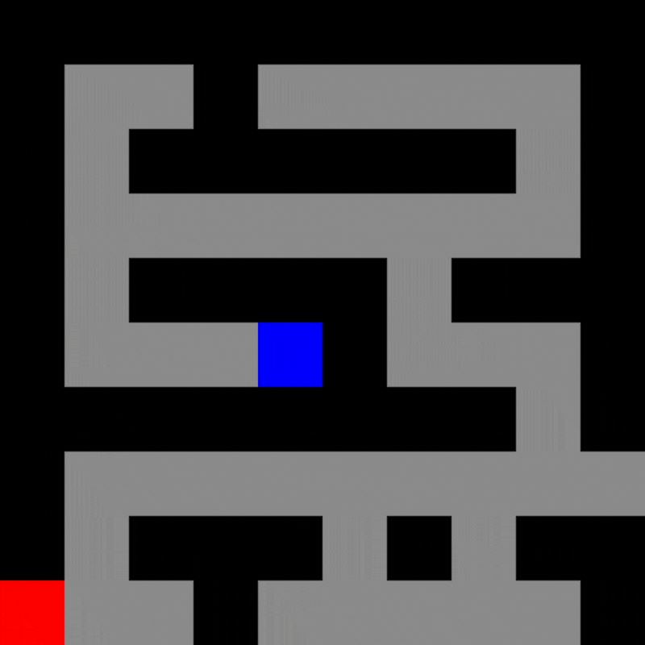
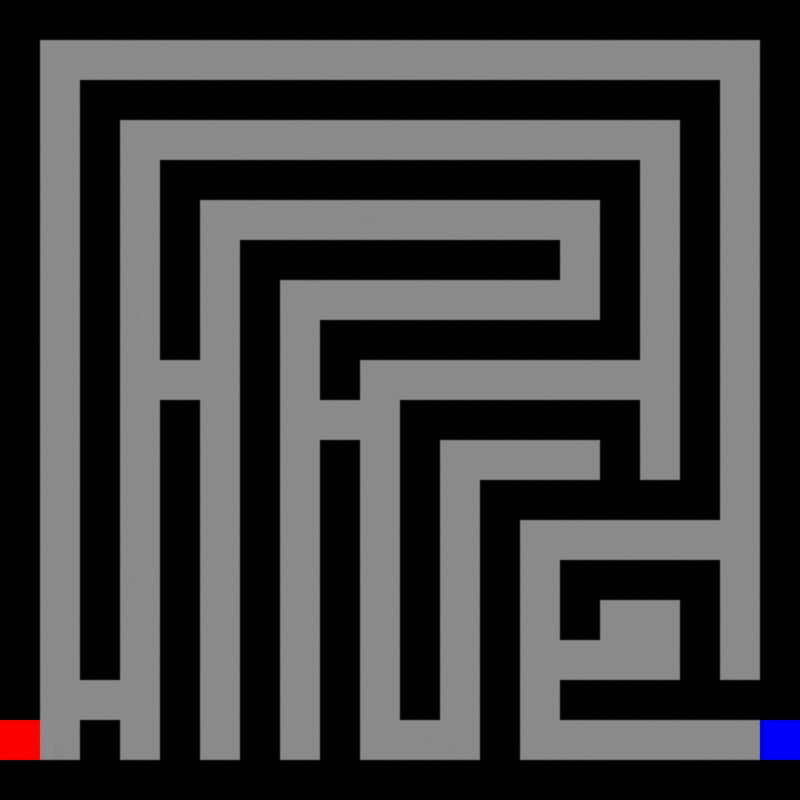

# Maze Solver

Maze Solver is a simple Python application that finds and visualizes the solution path for a maze using depth-first or breadth-first search algorithms.

  

## Table of Contents
- [Introduction](#introduction)
- [Features](#features)
- [Usage](#usage)
- [Installation](#installation)
- [File Structure](#file-structure)
- [Dependencies](#dependencies)

## Introduction

This project provides a maze-solving application that utilizes either a depth-first search (DFS) or breadth-first search (BFS) algorithm to find the solution path from the starting point (A) to the goal (B) in a given maze. The solution is then visualized using a graphical user interface built with Tkinter. A maze is given by a txt file where walls are **"1"s**, paths are **"0"s** the start and end positions are **"A"**
and **"B"** respectively.

## Features

- **Maze Solver Algorithms:** Choose between DFS and BFS algorithms for solving mazes. (For now the choice of algorithm as well as the maze is only made by changing the script)
- **Graphical Visualization:** Visualize the maze and the solution path in a graphical interface.

## Usage

1. Install the required dependencies (see [Installation](#installation)).
2. Run `main.py` to launch the application.
3. View the graphical representation of the maze and the solution path.

## Installation

1. Clone the repository:

    ```bash
    git clone https://github.com/makifcevik/maze-solver.git
    ```

2. Navigate to the project directory:

    ```bash
    cd maze-solver
    ```

3. Run the application:

    ```bash
    python main.py
    ```

## File Structure

- `maze.py`: Contains the `Maze` class for reading, processing, and solving mazes.
- `draw.py`: Implements the graphical representation of the maze using Tkinter.
- `main.py`: The main script to run the maze-solving application.
- `mazes/`: Directory containing maze files in text format.

## Dependencies

- Python 3.x
- Tkinter (included in standard Python installations)

